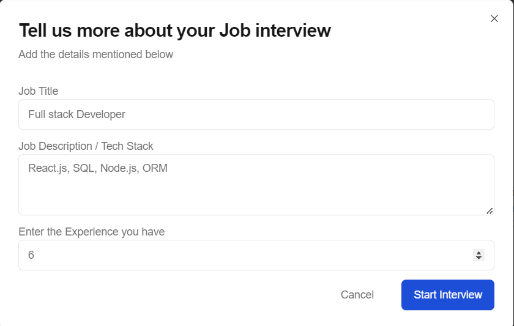
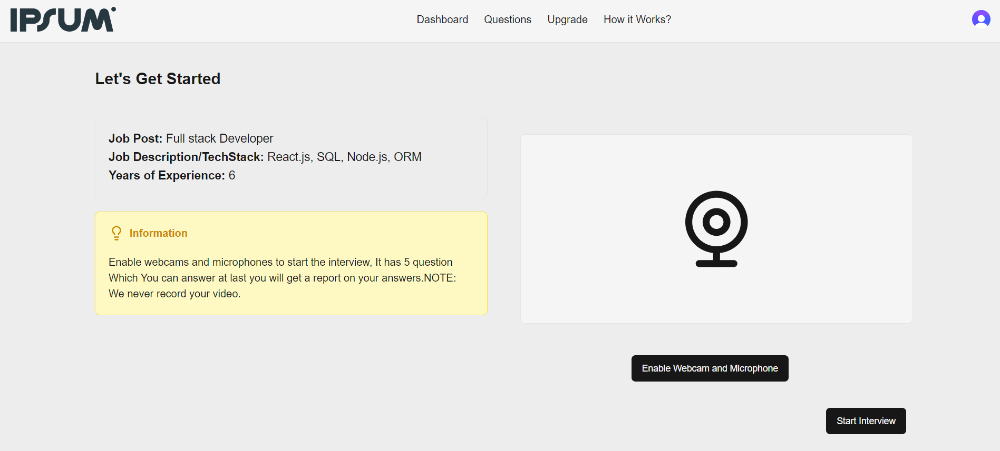
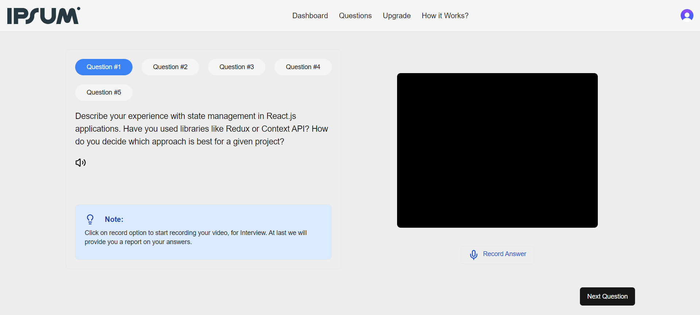
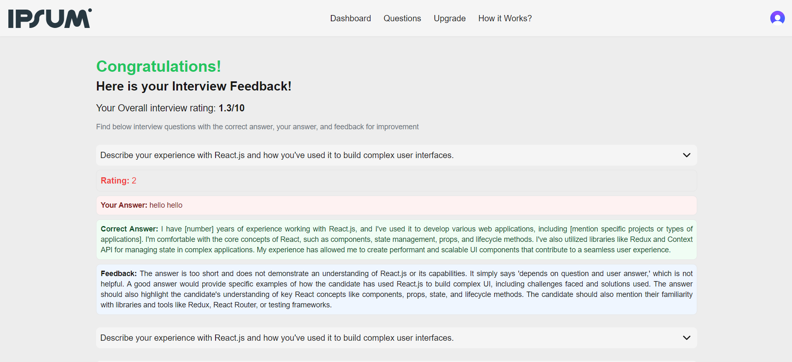

## .

IPSUM is a web application helps users simulate mock interviews for their desired job roles. Users provide key details such as job title, technology stack, and years of experience. Using generative AI, the app fetches relevant interview questions tailored to the specified role and expertise level. After completing the mock interview, users receive feedback with a performance rating, helping them identify areas for improvement. The platform is designed to enhance job readiness through personalized, real-time interview simulations. Ideal for professionals preparing for tech interviews across various domains.

       

## Table of contents
- [Features](#features)
- [Getting Started](#getting-started)
  - [Prerequisites](#prerequisites)
  - [Installation](#installation)
  - [Running the Application](#running-the-application)
- [Usage](#usage)
- [Deployment](#deployment)
- [Technologies Used](#technologies-used)
- [Contributing](#contributing)
- [License](#license)

## Features
- **Personalized Interview Questions**: Tailors interview questions based on user input, including job title, tech stack, and years of experience, ensuring relevance to their desired role.
- **Generative AI-Driven Questions**: Utilizes generative AI to create unique and up-to-date interview questions for a wide range of technical roles and industries.
- **Real-Time Feedback**: Provides detailed feedback and ratings after each mock interview, helping users assess their performance and identify areas for improvement.
- **Role-Specific Simulations**: Supports multiple job roles, allowing users to practice interviews for various positions across different technologies and experience levels.
- **Progress Tracking**: Tracks user performance over time, offering insights into their improvement across mock interviews, and helps users prepare more effectively.

## Getting Started

### Prerequisties
Before you begin please make sure to install this prerequisities
-Node.js (v18 or higher)
-npm or yarn
-neon Database account
-Drizzle orm
-Vs code or similar IDE'S

### Installation
1. Clone the repository
   ```
   git clone https://github.com/SandeepGarikapati/ai-interview-coach.git

   ```
2. Install the Dependencies
   ```
   npm install
   # or
   yarn install

   ```

### Running the Application
1. Setup the .env.local file with required api keys

```env
NEXT_PUBLIC_CLERK_PUBLISHABLE_KEY= clerk api key for authentication
NEXT_PUBLIC_CLERK_SIGN_IN_URL=/sign-in
NEXT_PUBLIC_CLERK_SIGN_UP_URL=/sign-up
NEXT_PUBLIC_DRIZZLE_DB_URL= prefered postgress DB url from local environment or providers like neon.

NEXT_PUBLIC_KEY_GEMINI= Gemini API Key

NEXT_PUBLIC_INFORMATION = "Enable webcams and microphones to start the interview, It has 5 question Which You can answer at last you will get a report on your answers.NOTE: We never record your video."

NEXT_PUBLIC_INFO2 = "Click on record option to start recording your video, for Interview. At last we will provide you a report on your answers."
```

2. First, run the development server:

```bash
npm run dev
# or
yarn dev
# or
pnpm dev
# or
bun dev
```

3. Open [http://localhost:3000](http://localhost:3000) with your browser to see the result.

## Usage

1. Fill the required details like tech stack, Experience etc and click on start Interview.
   


2. Check the Tech details and Enable the Webcam and Microphone to start the Interview.



3. Answer the Five Questions displayed to get the feedback.



4. Checkout the feedback displayed by the ai which indicated detailed analysis of the answer during the Interview.



You can start editing the page by modifying `app/page.js`. The page auto-updates as you edit the file.

This project uses [`next/font`](https://nextjs.org/docs/basic-features/font-optimization) to automatically optimize and load Inter, a custom Google Font.

## Learn More

To learn more about Next.js, take a look at the following resources:

- [Next.js Documentation](https://nextjs.org/docs) - learn about Next.js features and API.
- [Learn Next.js](https://nextjs.org/learn) - an interactive Next.js tutorial.

You can check out [the Next.js GitHub repository](https://github.com/vercel/next.js/) - your feedback and contributions are welcome!

## Deploy on Vercel

The easiest way to deploy your Next.js app is to use the [Vercel Platform](https://vercel.com/new?utm_medium=default-template&filter=next.js&utm_source=create-next-app&utm_campaign=create-next-app-readme) from the creators of Next.js.

Check out our [Next.js deployment documentation](https://nextjs.org/docs/deployment) for more details.
